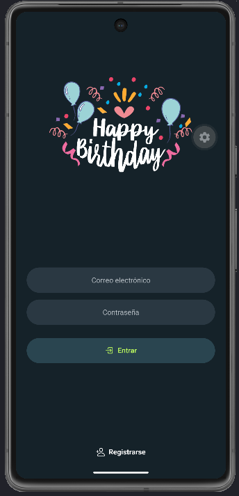
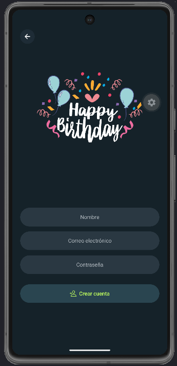
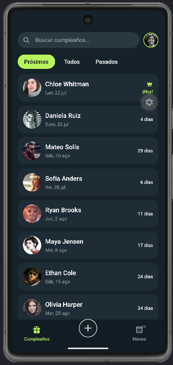
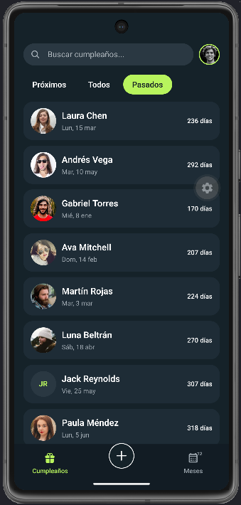
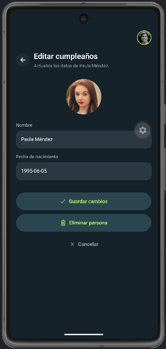
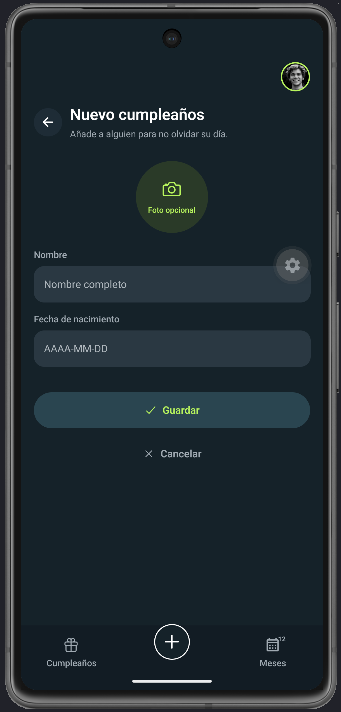

# Birthday App

App móvil para recordar cumpleaños de amigos y familia. Consulta próximos, pasados o todos, organízalos por mes y gestiona cada contacto desde una interfaz oscura con acentos lima.

Hecha con Expo, React Native, TypeScript y NativeWind.

## Demo

<p align="center">
  
  
  
</p>

<p align="center">
  
  
  
</p>

## Cómo correrlo

```bash
npm install
npx expo start --clear
```

Escanea el QR con Expo Go (Android/iOS) o pulsa `a` / `i` para abrir el emulador.

## Apoya el proyecto

Si te gusta la app o te sirve de referencia, **deja una estrella ⭐ en el repo**. Motiva a seguir mejorándola.
